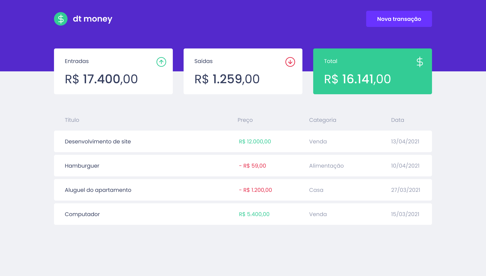

# dt money

<p>
  
  
  
  <a href="https://opensource.org/licenses/MIT">
    
  </a>
  <a href="https://github.com/luanpiresbresolla/dtmoney/commits/master">
    
  </a>
</p>

<br>

## Sobre o dt money

O dt money é uma aplicação para controlar as suas finaças pessoais, com o objetivo de melhorar sua vida financeira. Desenvolvido durante o Ignite [Rocketseat](https://rocketseat.com.br/).

<br>

## Layout

<p align="left">
  <a href="https://www.figma.com/file/0xmu9mj2TJYoIOubBFWsk5/dtmoney-Ignite-(Copy)?node-id=0%3A1">
    
  </a>
</p>

<br>

<p align="center">
  
</p>

## Tecnologias

Tecnologias e ferramentas utilizadas no desenvolvimento do projeto:

- [React](https://reactjs.org/)
- [TypeScript](https://www.typescriptlang.org/)

<br>

## Instalação e uso

```bash
# Realizando o clone do repositório
$ git clone https://github.com/LuanPiresBresolla/dtmoney
# ou use a opção de download.

# Entre na pasta web com
$ cd dtmoney

# Instalando dependências
$ yarn install

# Iniciando servidor da aplicação
$ yarn start
```

<br>

---

By [Luan Bresolla](https://github.com/LuanPiresBresolla)

[](https://www.linkedin.com/in/luanbresolla/)
[](mailto:luanpires34@gmail.com)
